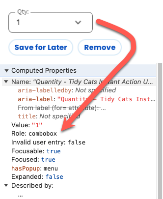
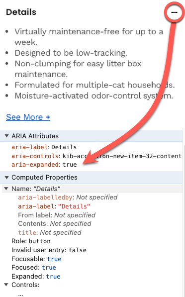

<!-- _footer: <p>Use your arrow keys to navigate between slides</p> -->

# Intro to WAI-ARIA

Global Accessibility Awareness Day

May 15th, 2025

---

<style>
  .visually-hidden {
    height: 1px;
    width: 1px;
    padding: 0;
    border: 0;
    margin: -1px;
    overflow: hidden;
    position: absolute;
    clip: rect(0 0 0 0);
  }
</style>

# WAI-ARIA


- WAI (Namespace):
    - Web Accessibility Initiative
- ARIA:
    - Accessible Rich Internet Applications

---

# What WAI-ARIA does

- Manipulates the Accessibility API
- Overrides native element Roles (with the `role` attribute)
- Describes the State of an element (with `aria-*`)
- Defines element Properties (with `aria-*`) 
- Describes element Hierarchy and Relationships (with `aria-*`)
- Observes Events (with `aria-*`)

---

# What WAI-ARIA does

- Helps make dynamic content and advanced UI controls accessible
- Identify regions of a page for efficient discoverability and navigation
- Identifies controls (and how to interact with them)
- Describes relationships between elements
- Represents the various states of controls
- Marks regions of the page that should be observed for dynamic updates

---

# What WAI-ARIA does not do

- Does not add any behavior
- Does not benefit anyone but screen reader users


---


<p class="visually-hidden">The Browser DOM, which is a hierarchical representation in text of the data and visual UI elements displayed on screen and is often manipulated in real time, based on user interactions, using Javacript, populates the Accessibility API which represents the DOM data as a combination of Roles, States and properties, hierarchical and relationship data, and keeps track of state and property events for every element in the page, is what Assistive Technology uses to announce content to screen reader users.</p>

---

# Roles



- Every element has a native `role`
- The `role` is reported to the user
- You cannot invent `roles`
- Do not specify `roles` that are implied
- [List of Roles (MDN)](https://developer.mozilla.org/en-US/docs/Web/Accessibility/ARIA/Roles)

<p class="visually-hidden">You can use the Chrome DevTools Accessibility Properties Panel to inspect the role of any element.  Select menus have a native role of "combobox"</p>

---

# `aria-*`

- booleans (including tristate and undefined)
- string
- integer
- number
- IDRefs
- URIs
- token or list of tokens (aka enumerated or limited fixed values)
- [List of `aria-*`(MDN)](https://developer.mozilla.org/en-US/docs/Web/Accessibility/ARIA/Attributes)

---

# States

Users are alerted when values change



- `aria-hidden`
- `aria-expanded`
- `aria-disabled`
- `aria-invalid`
- `aria-checked`
- `aria-busy`

<p class="visually-hidden">You can use the Chrome DevTools Accessibility Properties Panel to inspect the state of any element.  Selected menus have a native state of `aria-expanded=[true|false]`. When you create Menus and accordion widgets you have to define and manage these state values yourself, using `aria-expanded`.</p>

---

# Properties

Users are alerted when values change

- `aria-label`
- `aria-level`
- `aria-haspopup`
- `aria-modal`
- `aria-valuemin`
- `aria-valuemax`

---

# Relationships

- `aria-labelledby`
- `aria-describedby`
- `aria-controls`
- `aria-errormessage`
- `aria-posinset`

---

# Keyboard Accessibility

- `tabindex="0"`
    - Adds non-focusable elements focusable to the default tab order
- `tabindex="-1"`
    - Allows `focus()` to be moved to non-focusable elements
```
<div role="button" tabindex="0">I'm a button</div>
<div role="dialog" tabindex="-1">
    You can move focus to the dialog using Javascript focus(), 
    but you can't focus on it using your TAB key. 
</div>
```

---

# WAI-ARIA as CSS Selectors

You can make visual UI changes, using CSS, based on the management of your `aria-*` states and properties. 

The benefit of this is that you add a visual component to what is otherwise invisible functionality, increasing the likelihood that accessibility bugs will be identified because they have visual artifacts.
```
<ul role="presentation">
    <li role="checkbox" tabindex="0" aria-checked="true">
        I agree to the Terms and Conditions
    </li>
</ul>
[aria-checked="false"]::before {background-image: url(unchecked.png); }
[aria-checked="true"]::before {background-image: url(checked.png); }
```


---

# First Rule of ARIA Use

> If you can use a native HTML element or attribute with the semantics and behaviour you require already built in, instead of re-purposing an element and adding an ARIA role, state or property to make it accessible, then do so.

---

# Second Rule of ARIA Use

> Do not change native semantics, unless you really have to.

### Bad

```
<h2 role="tab">Tab Label</h2>
```

### Good

```
<div role="tab"><h2>Tab Label</h2></div>
```

---

# Third Rule of ARIA Use

> All interactive ARIA controls must be usable with the keyboard.

> If you create a widget that a user can click or tap or drag or drop or slide or scroll, a user must also be able to navigate to the widget and perform an equivalent action using the keyboard.

> All interactive widgets must be scripted to respond to standard key strokes or key stroke combinations where applicable.

See [ARIA Authoring Practices Guide](https://www.w3.org/WAI/ARIA/apg/patterns/)

---

# Fourth Rule of ARIA Use

> Do not use role="presentation" or aria-hidden="true" on a visible focusable element.

> Using either of these on a visible focusable element will result in some users focusing on 'nothing'.

```
<button aria-hidden="true">
    I'm still a focusable button because aria does not affect behavior, only semantics, but my text content is removed from the Accessibility API!
</button>
```

`display: none;` hides the element from EVERYONE
`visibility: hidden;` hides the element but if its focusable, 

---

# Fifth Rule of ARIA Use

> All interactive elements must have an [accessible name](https://chewyinc.atlassian.net/wiki/spaces/Pro/pages/1258455490/Accessible+Names+and+Descriptions).

> An interactive element only has an accessible name when its Accessibility API accessible name (or equivalent) property has a value.

---

# Sixth Rule of ARIA Use

> No ARIA is better than Bad ARIA

Good ARIA is used to make the visual experience match the functional experience for screen reader users

Bad ARIA can create a disconnect between the two that ONLY impacts screen reader users

1. A `role` is a PROMISE that you will add all the keyboard events, and manage all the states and properties expected for that `role`
2. ARIA overrides native semantics with accessibility semantics. This can:
    * Hide native semantics
    * Extend native semantics

---

# ARIA Validation

- Many `aria-*` attributes take values that are either boolean or enumerated. 
- Others take `id` references. 
- Others require that they be used with other `aria-*` attributes.
- Only a handful take string values which means it's easy to make mistakes.  

Invalid `aria` can have dire consequences for the user so it's critical to ensure we are using valid aria. When in doubt, check the [ARIA in HTML](https://www.w3.org/TR/html-aria/) You can use any [HTML Validator](https://validator.nu/), or Automated Accessibility Tool, like Chrome's Lighthouse, or [aXe DevTools Accessibiilty Extention](https://chromewebstore.google.com/detail/axe-devtools-web-accessib/lhdoppojpmngadmnindnejefpokejbdd) to validate your WAI-ARIA

---

# Q & A

* Immediately following this session, join us for a Screen Reader Demo!