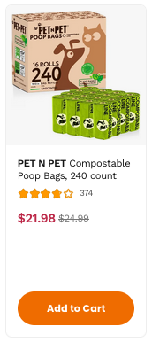
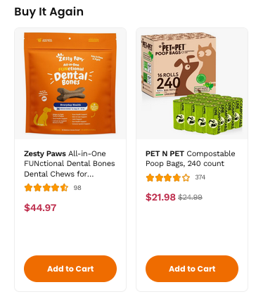
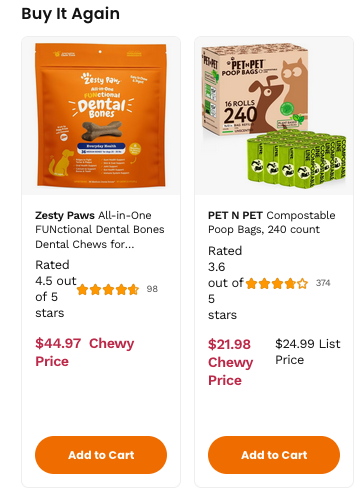

<style>
  .visually-hidden {
    height: 1px;
    width: 1px;
    padding: 0;
    border: 0;
    margin: -1px;
    overflow: hidden;
    position: absolute;
    clip: rect(0 0 0 0);
  }
</style>

<!-- _footer: <p>Use your arrow keys to navigate between slides</p> -->

# Live Regions and Off Screen Text

Global Accessibility Awareness Day

May 15th, 2025

---

<!-- footer: <p>Chewy Web Conference May 13th 2024</p> -->

# We *say* a lot of things visually



- We often say meaningful things with our visual designs
- We use proximity, borders, size, adjacency, colors, and paradigms from the built environment
- Sometimes we need to include content and context for non-visual users

<p class="visually-hidden">Take our product cards for example, which include 5 star shapes of various fill levels which represent the average review score from 1 to 5, and two prices, one in large, bold, red print indicating the Chewy price, and one in smaller, grey, crossed out text representing the List price. Without consideration, non-visual users will not be able to differentiate between the two prices.</p>

---

# Off Screen Text

- Using CSS to "hide" content is a technique as old as CSS, that's has helped us provide missing content and context to users who cannot see the screen.
- We place content in the DOM, then apply styles to it to either move it off-screen, beyond the bounds of the viewport, or stuff it in a box with zero dimensions.
- This content can still be accessed by screen reader users, but not displayed on screen.
- *SEO BONUS:* It can be accessed by search engines, too!

---

# `@mixin visually-hidden` 
```
@mixin visually-hidden() { 
  height: 1px;
  width: 1px;
  padding: 0;
  border: 0;
  margin: -1px;
  overflow: hidden;
  position: absolute;
  clip: rect(0 0 0 0);
 }
 ```

 Check out the [Chirp SASS Docs](https://www.chirp-web.info/sassdoc-chirp/a11y.html#a11y) for more info!

---



<p class="visually-hidden">Without special consideration, non-visual users will not be able to interpret the value of the star rating, or differentiate between the two prices.</p>

---




<p class="visually-hidden">When we include information in the DOM that puts a human readable value adjacent to the items that require additional context, like the star rating, or a label for Chewy Price versus List Price, the screen reader user reads this content as if it were part of the page, yet no visual artifact is present on screen.</p>

---

# It's useful for sighted keyboard users, too!

- Sometimes you want to provide helpful navigation tools for keyboard users that would be of no benefit to mouse users
- Make these controls off-screen by default, and use CSS to expose them on `:focus` (Skip links/Bypass Blocks)
- [Skip Link](https://www.chewy.com/)
- [Accordion Example](https://www.chewy.com/seresto-flea-tick-collar-dogs-over-18/dp/46498)

---

# Off Screen Text Gotchas

- Sometimes it's better to say it visually
- It's difficult to catch mistakes (write tests)
- Careful consideration of spacing is required (`&nbsp;` is your friend)

```
$12.89<span class="visually-hidden">Chewy Price</span> 
    <!-- BAD $12.89Chewy Price -->
$12.89 <span class="visually-hidden">Chewy Price</span> 
    <!-- BAD space to the right of price is rendered -->
$12.89<span class="visually-hidden">$nbsp;Chewy Price</span> 
    <!-- GOOD space is part of the hidden text -->
```

---

# Did you know?

*This presentation itself uses off screen text to provide content that represents the images to screen reader users since the images are rendered using CSS Background, which would otherwise make them completely inaccessible.*

---

# Live Regions

---

# Why are Live Regions needed?

- Screen readers can only have one point of focus
- Sighted users have the benefit of peripheral vision
- When content is changed on the page dynamically, screen reader users will not be aware of these changes e.g.
    - Error/Success messages
    - Process completion (content re-ordered/filtered)
    - Price/Sub Total changes

---

# Live Regions

- The `aria-live` attribute tells the Accessibility API to watch this element for dynamic changes.
- Those changes will be read based on the attributes value:
    - `"polite"` will wait until the screen reader is done saying what it is currently saying
    - `"assertive"` will clear the speech queue and update the user immediately
    - Whenever you have any dynamic content on a page, Live Region should be used appropriately

---

# Related Attributes

- `aria-relevant=[additions|text|removals|all]` allows you to control what types of changes are announced.  The default is `text|additions`
- `aria-atomic=[true|false]` The entire node that had changes, or just the part that changed. The default is `false`
- `aria-busy=[true|false]` allows you to hold off on reading the changes to the while `aria-busy=true` which can be helpful if changes are streaming in

*Support for these attributes is fairly poor. Functional testing must be performed if these attributes play a critical function.*

---

# Live Regions Gotchas

- Support, especially for related attributes, is inconsistent between tech stacks. Manual testing is recommended.
- Live Regions cannot be added to the DOM at the time the dynamic content is added. There needs to be enough time for the Accessibility API to register that it needs to observe the node for changes. It's always best to have an empty `<div aria-live="polite">` in the DOM at page load (an empty div takes up no physical space). Inject dynamic content into this container.

---

# Example Use Case

- Shopping Cart
    - Item Subtotal
    - Total items in cart
    - Progress towards free shipping

---

# Q&A
 
[ARIA Live Regions on Confluence](https://chewyinc.atlassian.net/wiki/spaces/Pro/pages/55444006/ARIA+Live+Regions)

Don't forget to check out other Accessibility Talks at the Chewy Web Conference:

- Today at 12:30/3:30 - Intro to WAI-ARIA
- Tommorow 9:30/12:30 - Manual Accessibility Testing
- Tommorow 10:15/1:15 - Screen Reader Testing (Mac Edition) LT
- Tommorow 12:15/3:15 - Screen Reader Testing (Windows Edition) LT
