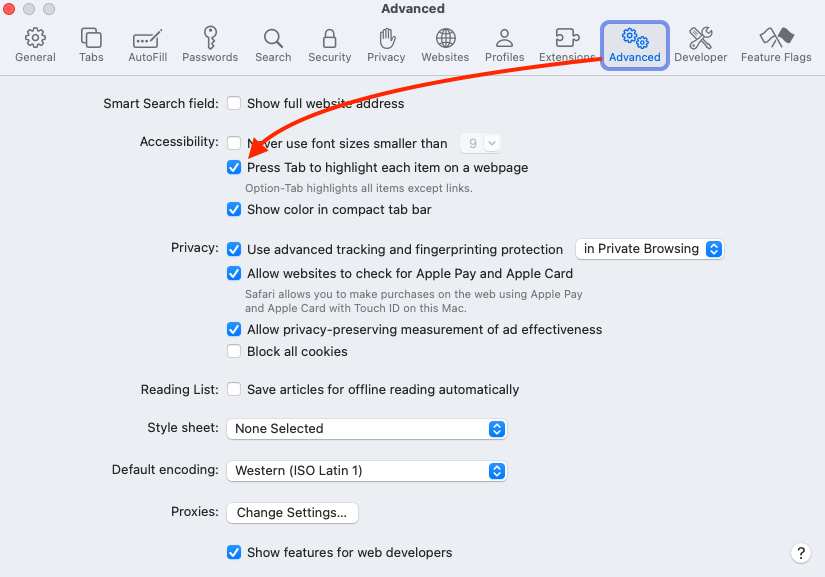

<!-- _footer: <p>Use your arrow keys to navigate between slides</p> -->

# Manual Accessibility Testing

Global Accessibility Awareness Day

May 15th, 2025

---

<!-- footer: <p>Global Accessibility Awareness Day May 15th 2025</p> -->


<style scoped>h1 { font-size: 3em; text-align: center; }</style>

# a11y is everyone's r12y

---
<style>section { font-size: 220%; } </style>

# What you'll need

- Keyboard (and an OS configured to use it)
- Google Chrome
- **EMPATHY**

---

# First perform your automated tests

- Use Chrome's Lighthouse -> Accessibility to test your page

OR

- Install and use the [aXe DevTools Accessibiilty Extention](https://chromewebstore.google.com/detail/axe-devtools-web-accessib/lhdoppojpmngadmnindnejefpokejbdd) (Preferred)

Work through the issues found by automated tools before any manual testing begins. Confluence contains custom support documentation for the [most common issues found by aXe DevTools](https://chewyinc.atlassian.net/wiki/spaces/a11ydoc/pages/2202174494/Accessibility+Testing+Error+Reference)

---

# Keyboard Tests

- One of the most important types of manual testing you can do because it covers people
    - With vision impairments (low and no)
    - With mobiliy impairments
    - Who use alternative input devices (sip and puff, eye-gaze, etc)
- Must be done without the mouse (AT ALL)
- Great empathy builder

---

# Getting Started

- If you're on a Mac, you'll need to [enable Keyboard navigation](https://chewyinc.atlassian.net/wiki/spaces/Pro/pages/123535782/Setting+up+your+Apple+device+for+accessibility+testing#Step-1---Enable-keyboard-navigation) at both the OS level, and in Safari.
- System Preferences -> Keyboard -> Toggle "Keyboard Navigation" switch
- Safari -> Settings -> Advanced -> Toggle "Press tab to Highlight each item on a webpage" checkbox 

---
<style scoped>section > p { margin: auto;}</style>


---
<style scoped>section > p { margin: auto;}</style>



---

# Turn on your empathy!

* It's important to be aware that, for most people who use a keyboard to browse the web, it's their *only* option.
* When they hit a dead end or become stuck, they cannot resort to a mouse to get out of it.
* Anything that you can do with your mouse (click, scroll, select, drag, drop, resize, etc) must also be possible to do with the keyboard alone.

---

# Start Testing

- Use your TAB key to move through the document. 
- Verify that you can focus on *everything* that a mouse user can click on (interactive content)
- Verify that you can SEE that the element has focus
- Verify that you can ALWAYS SEE where the focus is
- Verify that you can operate buttons (and anything that *looks* like a button) with the ENTER and SPACE keys

---

# Start Testing

- Verify that you can operate links with the ENTER key
- Verify that you can expand menus with ENTER and SPACE
- Verify that you can access items in menus with either TAB/Shift+TAB or Arrow keys
- Verify that you can close menus and dialogs with the ESC key and that your focus is returned to the button that opened the menu/dialog
- Verify that anything that is NOT interactive is NOT focusable

Did your focus disappear? Want to know where your focus is? Live expressions can help
```
document.activeElement();
```

---

# Dialogs

- Verify that when you open a dialog/sheet/smartshelf that 
    - the next time you hit the TAB key, you are inside the dialog, 
    - that you cannot TAB beyond the dialog (either cycling through or stopping at the end)
    - that you can close the dialog with the ESC key and the Close button
    - that your focus is moved back to the element that opened the dialog

---

# Forms

- Verify that you can TAB to all form controls, and visually identify which one has focus
- Can you visually identify controls that are radio buttons?  Checkboxes?
- Verify that you can TAB once to radio buttons, and use your arrow keys to change the value
- Verify that you can TAB to each checkbox independently
- Trigger an error message and verify that your focus moves to the top of the form, or to the first field with an error.

---

# Tab Controls

- Verify that the Tab List as a single TAB stop
- Verify that you can visually identify which Tab is active
- Verify that you can use your arrow keys to move between Tabs in the Tab List
- Verify that if the Tab Panel does not automatically change when you arrow to a new Tab, that it becomes active when you hit the ENTER key

---

# Page Zoom

- Use CTRL/CMD + and - to zoom the page to at least 200%
- Verify that no content is cutoff, missing, or overlapping with other content


---

# Forced Color Mode

- Verify that your page supports [Forced Color Mode](https://chewyinc.atlassian.net/wiki/spaces/Pro/pages/2055050132/Forced+Color+Modes+e.g.+Windows+High+Contrast+Mode)
    - Enable the Chrome DevTools Render Panel
        - Press Command+Shift+P (Mac) or Control+Shift+P (Windows) to open the Command Menu.
        - Type "Rendering"
        - Enable "Show Rendering"
    - Open the Chrome DevTools Render Panel
    - Change the following values
        - Emulate CSS media feature `prefers-color-scheme: dark`
        - Emulate CSS media feature `forced-colors: active`
    - Verify that all meaningful content is perceiveable 

---

# Page Structure

- Verify that the page has a single Level 1 Heading that introduces the main content
- Verify that all Headings follow a logical order and that no levels are skipped
- Verify that all significant sections of the page are preceded by a Heading that describes them

*My favorite tool for quickly checking all of the above is the [HeadingsMap Extension](https://chromewebstore.google.com/detail/headingsmap/flbjommegcjonpdmenkdiocclhjacmbi)*

---

# Page Landmarks

- Verify that all content is contained within an HTML5 Landmark region
- Verify that all non-unique landmark regions have an `aria-label` that differentiates them

*My favorite tool for quickly checking all of the above is the [Landmarks Extension](https://chromewebstore.google.com/detail/landmark-navigation-via-k/ddpokpbjopmeeiiolheejjpkonlkklgp), and if you want to benefit from the same efficiency gains as screen reader users, install the [Skip to Headings and Landmarks Extension](https://chromewebstore.google.com/detail/skipto-landmarks-headings/fjkpbfcodhflpdildjbmdhhmcoplghgf)*

---

# Accessible Names

> All interactive elements must have an [accessible name](https://chewyinc.atlassian.net/wiki/spaces/Pro/pages/1258455490/Accessible+Names+and+Descriptions). *-- The Fifth Rule of ARIA*

- Use your DevTools to verify that all elements have an accessible name
    - DevTools -> Accessibility Panel -> Toggle "Switch to Accessibility Tree View"

OR

Enable a couple of live expressions
```
document.activeElement();
```
```
const { default: accname } = await import('https://cdn.skypack.dev/accname');
accname.getAccessibleName(document.activeElement);
```

---

# Q&A

* Immediately following this session, join us for a fireside chat with Jennison Asuncion, co-founder of GAAD
* Come back at 12 PT / 3 ET for Intro to WAI-ARIA
