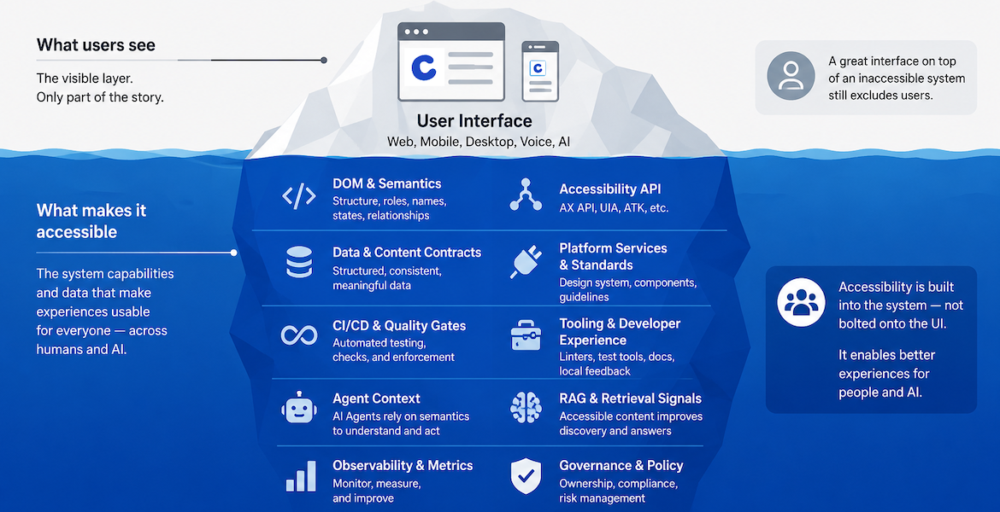
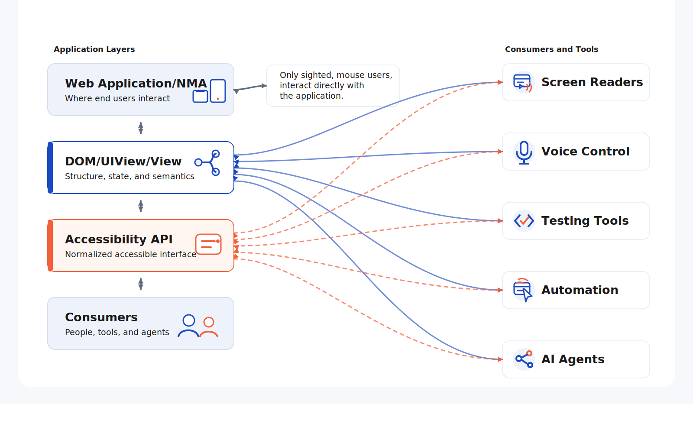
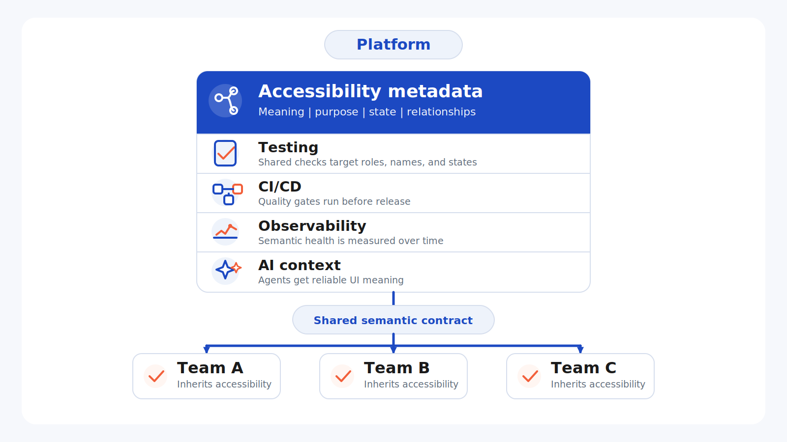
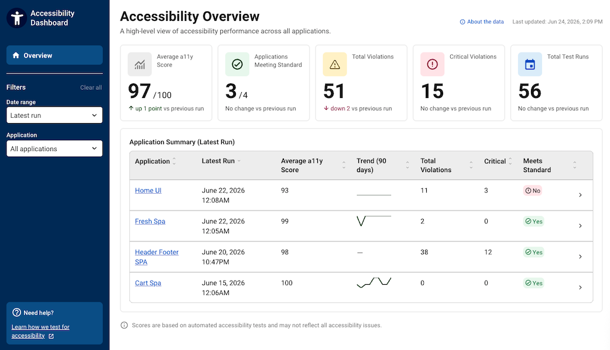

<!-- _class: lead -->

# Accessibility at Chewy

<!--
There are a lot of misconceptions about the who, what, why, and when of Accessibility and I hear many of those echoed back to me when I discover large accessibility gaps: "It's a design, or a frontend problem" OR  "It's impact is so narrow it's not worth spending time on." But, in only 15 minutes, rather than talk about all the benefits accessibility has for our end users, I'm going to try to convince you to start thinking of Accessibility as a Platform Capability, not something relegated to front end engineering. Accessibility should be part of every discussion we have on platform architecture, data structure, dev standards, tooling, and governance.
-->

---

<!-- _class: image-slide -->

# Accessibility is a platform capability



<section class="sr-only">

  <p><strong>What users see:</strong> User Interface. Web, Mobile, Desktop, Voice, AI.</p>

  <p><strong>Key message:</strong> The visible layer is only part of the story. A great interface on top of an inaccessible system still excludes users.</p>

  <h3>What makes it accessible</h3>
  <ul>
    <li><strong>DOM and Semantics:</strong> Structure, roles, names, states, relationships.</li>
    <li><strong>Accessibility API:</strong> AX API, UIA, ATK, etc.</li>
    <li><strong>Data and Content Contracts:</strong> Structured, consistent, meaningful data.</li>
    <li><strong>Platform Services and Standards:</strong> Design system, components, guidelines.</li>
    <li><strong>CI/CD and Quality Gates:</strong> Automated testing, checks, and enforcement.</li>
    <li><strong>Tooling and Developer Experience:</strong> Linters, test tools, docs, local feedback.</li>
    <li><strong>Agent Context:</strong> AI agents rely on semantics to understand and act.</li>
    <li><strong>RAG and Retrieval Signals:</strong> Accessible content improves discovery and answers.</li>
    <li><strong>Observability and Metrics:</strong> Monitor, measure, and improve.</li>
    <li><strong>Governance and Policy:</strong> Ownership, compliance, risk management.</li>
  </ul>

  <p>Accessibility is built into the system, not bolted onto the UI. It enables better experiences for people and AI.</p>
</section>

<!--
So Applications, both web and NMA, have visual User Interfaces that most of us just look at, scroll, click, tap, drag. But those who do not interact with their devices that way, because of a particular disability, are interacting with our applications using assistive technology, which at a basic level translates that visual UI into something they can work with, be it a screen reader, screen magnififer, voice control, or something other than a pointing device. The success of that translation step depends on machine-readable data that represents that visual rendering.

That intermediary layer happens to be closely tied to the way, 1. search engines index information, 2. data is streamed to the browser, 3. test automation scripts work, 4. and how successful AI agents and workflows are at extracting context and interacting with applications on a user's behalf. When you build accessibility first platforms, all of these other capabilities come along for free, because search engines, test automation, RAG Workflows, and AI Agents all use the same accessibility metadata.
-->

---

<!-- _class: image-slide -->

# The Accessibility API



<section class="sr-only">

  <h2>Application Layers</h2>

  <h3>Web Application/NMA</h3>
  <p>Where end users interact. Updates flow into the DOM, which exposes structure, state, and semantics to the Accessibility API and consumers.</p>

  <p>Only sighted, mouse users interact directly with the web application. Assistive technologies, testing tools, automation, and AI agents instead consume semantics from the DOM and Accessibility API.</p>

  <h3>DOM/UIView/View</h3>
  <p>Structure, state, and semantics. Consumers and tools exchange semantic information bidirectionally with the DOM and with the Accessibility API.</p>

  <h3>Accessibility API</h3>
  <p>Normalized accessible interface derived from the DOM. Consumers and tools exchange semantic information bidirectionally with the Accessibility API and with the DOM.</p>

  <h3>Consumers</h3>
  <p>People, tools, and agents that consume semantic information from the DOM and Accessibility API.</p>

  <h2>Consumers and Tools</h2>
  <ul>
    <li><strong>Screen Readers:</strong> Retrieves semantic information from the DOM and Accessibility API.</li>
    <li><strong>Voice Control:</strong> Retrieves semantic information from the DOM and Accessibility API and manipulates using available APIs.</li>
    <li><strong>Testing Tools:</strong> Retrieves semantic information from the DOM and Accessibility API and manipulates using available APIs.</li>
    <li><strong>Automation:</strong> Retrieves semantic information from the DOM and Accessibility API and manipulates using available APIs.</li>
    <li><strong>AI Agents:</strong> Retrieves semantic information from the DOM and Accessibility API and manipulates using available APIs.</li>
  </ul>

</section>

<!-- I want to talk a little bit about the Accessibility API, because once you understand how Accessibility works, under the hood, from a technical perspective, it should become obvious how tightly coupled it is with platform enablement. 

[HISTORY OF AAPI] Accessibility engineers have been building machine-readable user interfaces for decades. AI agents are simply the newest consumers.

I want everyone to stop thinking of accessibility as something just for screen reader users. Accessible platforms improve SEO (you may have heard of the billion dollar blind user before), make it easier to write Automated tests and automate browser actions (you're probably already writing tests that target elements by "role", right, or "name". Both of those were created in the early 80's for accessibility, not testing.) And now we have AI.  The thing all of these have in common is rich, semantic, machine-readable metadata and text content. Accessibility engineers have been building machine-readable user interfaces for decades. AI agents are simply the newest consumers. -->

---

# Accessibility Is Structured Meaning

Probablistic

```html
<h3>Blue Buffalo Chicken Recipe 24lb Bag</h3>
<p>$34.99</p>
<button>
  Add to Cart 
</button>
<!-- Button value = Add to Cart -->
```

<!--
Take a look at this simplistic product card markup. Think about writing automation scripts, or pointing an AI Agent at this code.
-->

------

# Accessibility Is Structured Meaning

Deterministic

```html
<h3 id="name_8903846">Blue Buffalo Chicken Recipe 24lb Bag</h3>
<p id="price_8903846">$34.99</p>
<button
  aria-labelledby="action_8903846 name_8903846"
  aria-describedby="price_8903846">
  <span id="price_8903846">Add to Cart</span>
</button>
<!-- Button value = Add to Cart Blue Buffalo Chicken Recipe 24lb Bag, $34.99 -->
```

<!--
Semantic and expressive HTML are not just accessibility concepts. They're business concepts. Accessibility simply exposes them in a machine-readable way.  Can AI work with unstructured data? Yes, and its surprisingly pretty good at it, but with structured data you get reduced token usage, reduced latency, and near deterministic accuracy.  As far as testing goes, I laugh whenever I see `data-testid` anywhere. Why not use the `id` attribute, which has been supported since HTML 3.1 and can be used for all the same test functioanlity AND accessibility. Support for data-* attributes was added in HTML 5 to solve the async data challenges introduced by modern web dev. Not to make it easier to target elements for automated tests.  the `id` attribute solved that 35 years ago. 
-->

---

<!-- _class: image-slide -->

# Accessibility as a Platform Capability



<section class="sr-only">
  <h2>Should application developers reinvent or inherit accessibility?</h2>
  <p>A platform stack starts with accessibility metadata: meaning, purpose, state, and relationships. Testing, CI/CD, observability, and AI context consume that semantic foundation.</p>
  <ul>
    <li><strong>Testing:</strong> Shared checks target roles, names, and states.</li>
    <li><strong>CI/CD:</strong> Quality gates run before release.</li>
    <li><strong>Observability:</strong> Semantic health is measured over time.</li>
    <li><strong>AI context:</strong> Agents get reliable UI meaning.</li>
    <li><strong>Team A, Team B, and Team C:</strong> All inherit accessibility from the platform.</li>
  </ul>
</section>

<!-- So here is my big pitch. Accessibility at Chewy has been a grassroots, bottom up initiative that has struggled to scale with the pace of growth. Organizations don't scale accessibility by hiring more accessibility engineers. They scale accessibility by building accessible platforms. The accessibility team is currently developing tooling the help with this, and we will be asking each team to implement this tooling very soon, but we're also hoping that all of the people in this room start thinking about accessibilty during any architectural or platform discussion. I often run into custom and complicated features developed for the sole purpose of SEO, test automation, telemetry, analytics, etc.  That same data was already there, or should have been there, for accessibility, then just consumed for those other purposes.

The accessibility community has spent decades solving a problem that many organizations are only now rediscovering:

 How do you expose the meaning, purpose, state, and relationships of a user interface in a machine-readable way?

 Accessibility is not merely about disability accommodation.

 It is one of the most mature implementations of machine-readable user experience metadata that exists today.

-->

---

<!-- _class: image-slide -->

# Accessibility as Observability



<section class="sr-only">
  <p>Screenshot of an Accessibility Overview dashboard showing accessibility metrics across multiple applications. Summary cards at the top report an average accessibility score of 97 out of 100, 3 of 4 applications meeting the accessibility standard, 51 total violations, 15 critical violations, and 56 total test runs.</p>
</section>

<!--
The Accessibility Team has been working on building a centralized, automated, accessibility testing framework that can be added as a package to your existing Chewy application. When added to your CI/CD pipeline, the framework can publish conformance metrics to our new observability dashboard. Hopefully, I've convinced you of the direct relationship between accessibility and platform health, code quality, and AI readiness. Try not to think of thise dashboard as a measure of accessibility conformance, but as an indicator of platform quality. It's not just a measure of our accessibility, but of the health of our semantic layer.
-->

---

# Get involved

## a11y is everyone's r11y

- E2E tests 
  (<https://github.com/Chewy-Inc/chewy-a11y-automation>)
- Unit tests, Audits and more
  (<https://github.com/Chewy-Inc/accessibility-skills>)
- [Accessibility Documentation](https://chewyinc.atlassian.net/wiki/spaces/a11ydoc/overview)
- [#accessibility-general](https://chewy.enterprise.slack.com/archives/C0A8DLEJ2NA)
- [#access-public](https://chewy.enterprise.slack.com/archives/CDV9M793M)

<!-- Accessibility isn't another engineering concern competing for attention. It's evidence that our systems expose meaning not just pixels. Systems that expose meaning are easier to test, easier to automate, easier to observe, easier for AI to understand, and easier for every customer to use. 
-->
