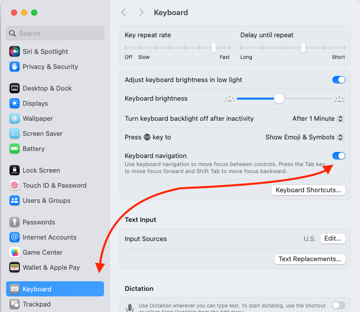
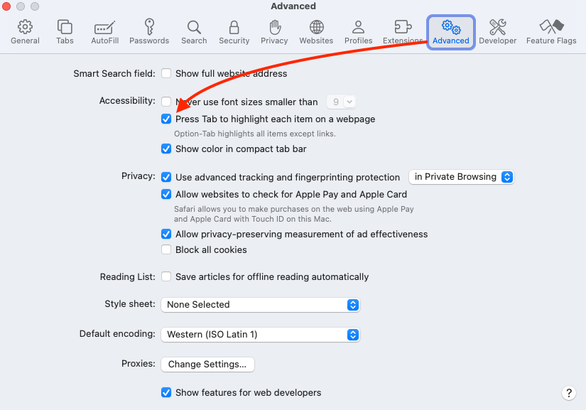

<!-- _footer: 
Use your arrow keys to navigate between slides
 -->

# Screen Reader Testing (Mac Edition)

Chewy Web Conference Lighting Talk

May 8th, 2024

---

# What you'll need

- A Mac
- Safari Web Browser
- Keyboard (and an OS configured to use it)
- **EMPATHY**

---

# Keyboard Configuration

- If you're on a Mac, you'll need to [enable Keyboard navigation](https://chewyinc.atlassian.net/wiki/spaces/Pro/pages/123535782/Setting+up+your+Apple+device+for+accessibility+testing#Step-1---Enable-keyboard-navigation) at both the OS level, and in Safari.
- System Preferences -> Keyboard -> Toggle "Keyboard Navigation" switch
- Safari -> Settings -> Advanced -> Toggle "Press tab to Highlight each item on a webpage" checkbox 

---

---

---

# Fire it up!

- Open Safari
- Visit the page you want to test
- Command + F5 will toggle Voiceover On/Off
- If its the first time starting it up, you'll be asked to go through a tutorial (do it!  maybe not right now, but next time you fire it up)
- Now you know how to turn Voiceover on/off.  Let's turn it off for now.

---

# The Basics

- It's important to remember that screen reader users have no other choice but to use ONLY their keyboard, and only their screen reader, so if you find that you cannot access something (and you're sure it's not because you're not an expert SR user) it's a bug.  If you have to resort to your mouse to get passed something, or complete a task, its a bug.
- Screen reader function relies on just about every key on the keyboard, so in order to prevent the H key from typing an H, and using it to go to the next Heading instead, you have to combine it with "VO Keys", which are CTRL + Option.  When VO Testing, your left hand will be holding down these keys most of the time (Unless Quick Key Nav is turned on)

---

# More Basics

- Screen Reader users have three modes of operation that they are constantly switching between:
    * Reading mode (use VO + Left and Right Arrow)
    * Interactive mode (Using just the TAB/Enter/Space/Arrow keys)
    * Quick Key Navigation (Advanced/Efficient)
* Try moving through the first two, and notice the different way the screen reader behaves

---

# Quick Key Navigation

* Web Rotor (CTRL + Option + U)
* Arrow Key Quick Nav (VO + Shift + Q)
* Single Key Quick Nav (VO + Q)
    - Go to System Settings -> Accessibility -> Voiceover -> Voiceover Utility -> Open Voiceover Utility -> Quick Nav -> Assing Commands -> Single keys to see a list of available options

---

# What to look for

* While using Voiceover, imagine that the screen was completely blank.
    * Is VO telling you everything you need to know to understand the purpose of the control?
        * The type of control it is e.g. link, button, text field
        * The label or name for the control (its purpose or function)
        * The states or properties of that control (is there a popup, is it expanded or closed, are typeahead options available, like they are to a sighted person, etc.)
    * Is VO Presenting things to you in a logical order?
    * Can you access everything you would expect to access?
    * Is there redundant information that is annoying or cumbersome to navigate?

---

# What to do

If you find bugs, reach out to #accessibility-general Slack channel, me directly, or come to Accessibility Office Hours. There are so  many different options for optimizing and fixing the screen reader user experience.  Let's work together to figure that out.  

---

# Q&A

* Come back at 12:15 PT / 3:15 ET for Intro to Screen Reader Testing on Windows
